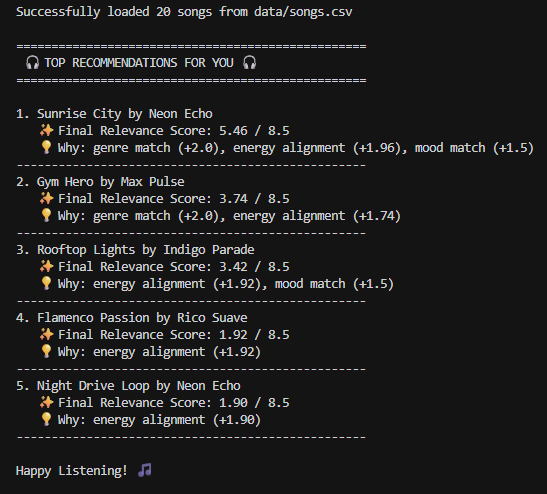
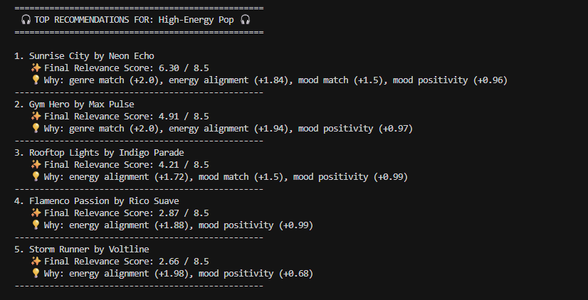
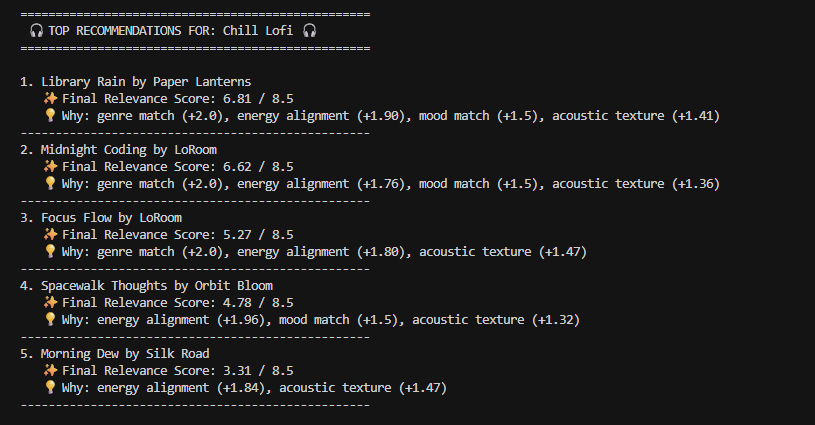
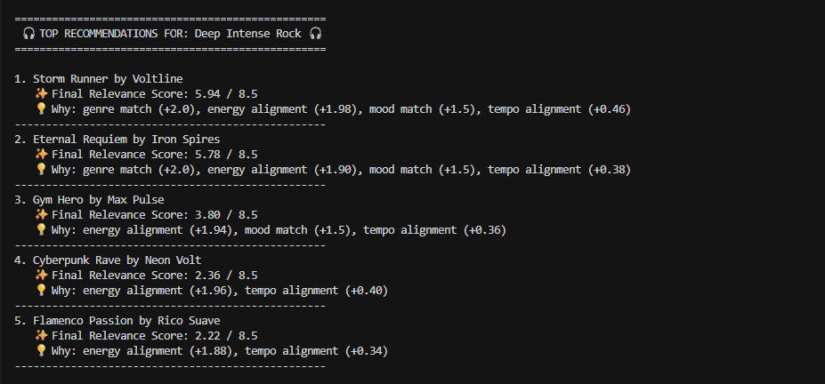
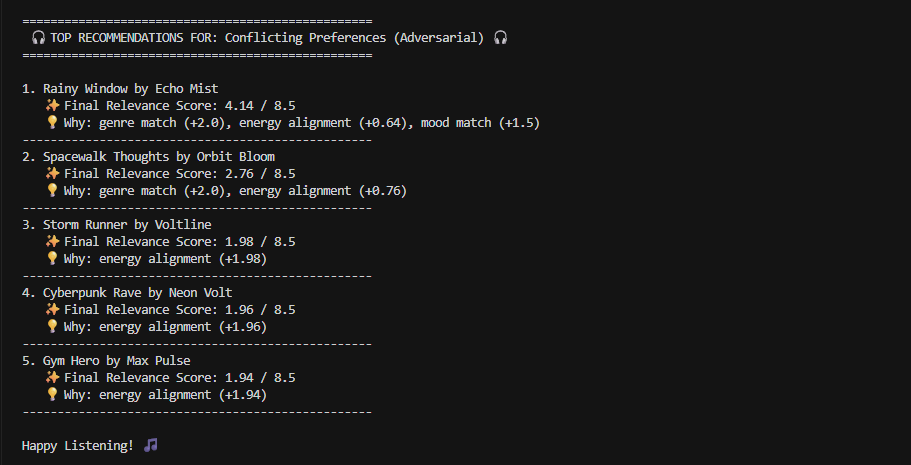

# 🎵 Music Recommender Simulation

## Project Summary

In this project you will build and explain a small music recommender system.

Your goal is to:

- Represent songs and a user "taste profile" as data
- Design a scoring rule that turns that data into recommendations
- Evaluate what your system gets right and wrong
- Reflect on how this mirrors real world AI recommenders

Replace this paragraph with your own summary of what your version does.

---

## How The System Works

Major streaming platforms like Spotify and YouTube use hybrid recommendation systems that combine "Collaborative Filtering" (analyzing what similar users enjoy) with "Content-Based Filtering" (analyzing the specific attributes of a song).

This simulation employs a **Content-Based Filtering** approach. The system prioritizes "Sonic Alignment"—the mathematical similarity between a user's stated preferences and the available catalog.

### The Algorithm Recipe
The system calculates a "Relevance Score" (Max 8.5 pts) for every song in the catalog using a weighted point system:

| Feature | Weight (Max Points) | Scoring Logic |
| :--- | :--- | :--- |
| **Genre Match** | **+2.0 pts** | Exact match with user's favorite genres. |
| **Energy Similarity** | **+2.0 pts** | Reward songs closer to target energy (0.0-1.0). |
| **Mood Match** | **+1.5 pts** | Exact match with user's favorite moods. |
| **Acousticness** | **+1.5 pts** | Reward songs closer to target acousticness level. |
| **Valence** | **+1.0 pts** | Reward songs matching user's target positivity level. |
| **Tempo (BPM)** | **+0.5 pts** | Reward songs closer to target beats per minute. |

**Expected Biases:**
- **Genre Over-Prioritization:** Because a Genre match is weighted as highly as Energy, the system might ignore a perfect "chill lofi" track that exactly matches the user's energy and mood targets simply because the user didn't explicitly list "Lofi" in their favorite genres.
- **Precision Bias:** The system focuses on the closest mathematical matches, which can lead to a "filter bubble" where the recommendations lack diversity or surprise.

### Data Inputs
- **Song Features:** Metadata (Genre, Mood) and normalized acoustic data (Energy, Valence, Danceability).
- **User Profile:** A collection of target values representing ideal musical preferences.
- **Weights:** A configuration that determines the relative importance of each feature.



---

## Getting Started

### Setup

1. Create a virtual environment (optional but recommended):

   ```bash
   python -m venv .venv
   source .venv/bin/activate      # Mac or Linux
   .venv\Scripts\activate         # Windows

2. Install dependencies

```bash
pip install -r requirements.txt
```

3. Run the app:

```bash
python -m src.main
```

### Running Tests

Run the starter tests with:

```bash
pytest
```

You can add more tests in `tests/test_recommender.py`.

---

## Experiments You Tried

In this phase, I stress-tested the recommender with four distinct user profiles to evaluate how the scoring logic handles different musical tastes and edge cases.

### 1. High-Energy Pop
*   **Target:** Pop genre, Happy mood, 0.9 Energy.
*   **Result:** Successfully recommended **"Sunrise City" (6.30/8.5)** and **"Gym Hero" (4.91/8.5)**.
*   **Observation:** The system effectively combined genre and energy alignment for these "ideal" matches.



### 2. Chill Lofi
*   **Target:** Lofi genre, Chill mood, 0.3 Energy, 0.8 Acousticness.
*   **Result:** Top pick was **"Library Rain" (6.81/8.5)**.
*   **Observation:** This profile achieved the highest overall scores, as the catalog has several tracks that perfectly match the "lofi-chill" archetype.



### 3. Deep Intense Rock
*   **Target:** Rock/Metal, Intense/Aggressive, 0.9 Energy, 160 BPM.
*   **Result:** **"Storm Runner" (5.94/8.5)** and **"Eternal Requiem" (5.78/8.5)**.
*   **Observation:** The system successfully prioritized BPM and energy alongside genre.



### 4. Conflicting Preferences (Adversarial)
*   **Target:** Ambient genre, Melancholic mood, but with a high **0.9 Energy** target.
*   **Result:** **"Rainy Window" (4.14/8.5)**.
*   **Observation:** **The Glitch Found:** Even though the user wanted 0.9 energy, the system recommended a track with 0.22 energy because the **Genre Match (+2.0)** and **Mood Match (+1.5)** points outweighed the energy penalty. This reveals a bias where categorical data (Genre/Mood) can "drown out" the physical characteristics (Energy) of the music.



---

## Limitations and Risks

Summarize some limitations of your recommender.

Examples:

- It only works on a tiny catalog
- It does not understand lyrics or language
- It might over favor one genre or mood

You will go deeper on this in your model card.

---

## Reflection

Read and complete `model_card.md`:

[**Model Card**](model_card.md)

Write 1 to 2 paragraphs here about what you learned:

- about how recommenders turn data into predictions
- about where bias or unfairness could show up in systems like this


---

## 7. `model_card_template.md`

Combines reflection and model card framing from the Module 3 guidance. :contentReference[oaicite:2]{index=2}  

```markdown
# 🎧 Model Card - Music Recommender Simulation

## 1. Model Name

Give your recommender a name, for example:

> VibeFinder 1.0

---

## 2. Intended Use

- What is this system trying to do
- Who is it for

Example:

> This model suggests 3 to 5 songs from a small catalog based on a user's preferred genre, mood, and energy level. It is for classroom exploration only, not for real users.

---

## 3. How It Works (Short Explanation)

Describe your scoring logic in plain language.

- What features of each song does it consider
- What information about the user does it use
- How does it turn those into a number

Try to avoid code in this section, treat it like an explanation to a non programmer.

---

## 4. Data

Describe your dataset.

- How many songs are in `data/songs.csv`
- Did you add or remove any songs
- What kinds of genres or moods are represented
- Whose taste does this data mostly reflect

---

## 5. Strengths

Where does your recommender work well

You can think about:
- Situations where the top results "felt right"
- Particular user profiles it served well
- Simplicity or transparency benefits

---

## 6. Limitations and Bias

Where does your recommender struggle

Some prompts:
- Does it ignore some genres or moods
- Does it treat all users as if they have the same taste shape
- Is it biased toward high energy or one genre by default
- How could this be unfair if used in a real product

---

## 7. Evaluation

How did you check your system

Examples:
- You tried multiple user profiles and wrote down whether the results matched your expectations
- You compared your simulation to what a real app like Spotify or YouTube tends to recommend
- You wrote tests for your scoring logic

You do not need a numeric metric, but if you used one, explain what it measures.

---

## 8. Future Work

If you had more time, how would you improve this recommender

Examples:

- Add support for multiple users and "group vibe" recommendations
- Balance diversity of songs instead of always picking the closest match
- Use more features, like tempo ranges or lyric themes

---

## 9. Personal Reflection

A few sentences about what you learned:

- What surprised you about how your system behaved
- How did building this change how you think about real music recommenders
- Where do you think human judgment still matters, even if the model seems "smart"

