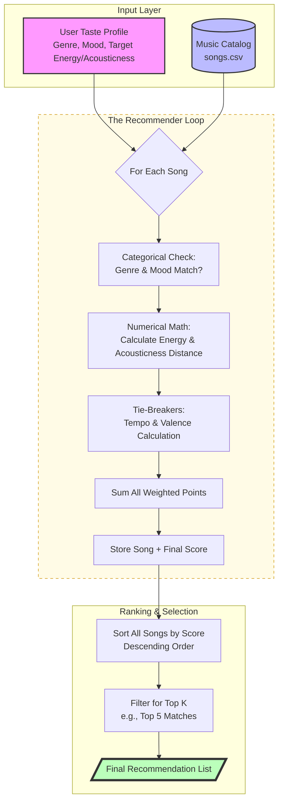

# 🎧 Music Recommender Design

## 1. Flowchart


## 2. Scoring Recipe

| Feature | Type | Weight (Max Points) | Logic |
| :--- | :--- | :--- | :--- |
| **Genre Match** | Categorical | **+2.0 pts** | Exact match with any genre in the user's "favorites" list. |
| **Mood Match** | Categorical | **+1.5 pts** | Exact match with any mood in the user's "favorites" list. |
| **Energy Similarity** | Numerical | **+2.0 pts** | `2.0 * (1.0 - abs(song_energy - target_energy))` |
| **Acousticness** | Numerical | **+1.5 pts** | `1.5 * (1.0 - abs(song_acousticness - target_acousticness))` |
| **Valence (Positivity)** | Numerical | **+1.0 pts** | `1.0 * (1.0 - abs(song_valence - target_valence))` |
| **Tempo (BPM)** | Numerical | **+0.5 pts** | `0.5 * (1.0 - (abs(song_bpm - target_bpm) / 100))` (min score 0) |

**Total Max Score: 8.5 points**

## 3. User Taste Profile: "Midnight Study"
```python
user_profile = {
    "favorite_genres": ["lofi", "ambient", "jazz"],
    "favorite_moods": ["chill", "focused", "relaxed"],
    "target_energy": 0.30,
    "target_valence": 0.60,
    "target_danceability": 0.45,
    "target_acousticness": 0.80,
    "target_tempo_bpm": 80
}
```
